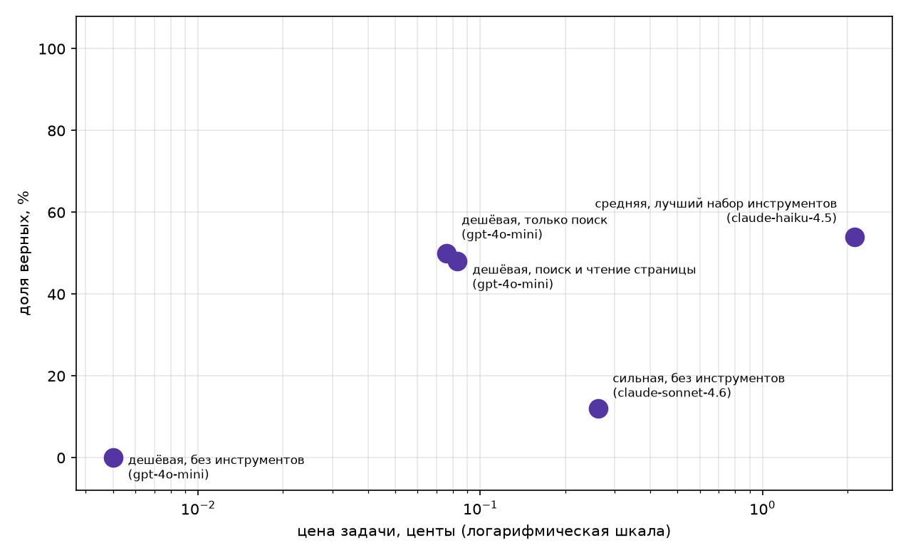

# Pet Agent

Учебный проект по разработке собственного LLM-агента на Python.

## Prerequisites

- Python 3.10+ Проверить версию: python --version
- Аккаунт OpenRouter с API-ключом (формат sk-or-v1-...)

## Quick Start

1. Клонируйте репозиторий и перейдите в его директорию

```bash
   git clone <ссылка-на-репозиторий>
   cd pet-agent
```

2. Установите зависимости

```bash
   pip install requests pydantic python-dotenv
```

3. Настройте переменные окружения

```bash
   cp .env.example .env
```

4. Впишите ваши ключи в .env:

```
   OPENROUTER_API_KEY=sk-or-v1-...
   TAVILY_API_KEY=tvly-...
```

## Dataset (data/my_fresh_2026.jsonl)

Тема — свежие новости веб-разработки и фронтенда за 2026 год: обновления
браузеров, CVE, новые CSS/HTML-фичи, JS-библиотеки, конференции.

Источники — дайджесты **Frontend Status** на Habr (`#7, #8, #10, #14, #15, #18`, 68 из 72 вопросов) и две отдельные статьи, одна на Habr, одна на lawebbox.com (итого 2 домена: `habr.com`, `lawebbox.com`). Все источники открытые, вопросы и цитаты — по-русски.

## Fresh check

```
$ python check_fresh.py data/my_fresh_2026.jsonl --sonnet
записей: 72, проблем: 0

Sonnet без инструментов: 4 из 72 верно, 6%. Потрачено $0.233
критерий свежести пройден
  fresh-0: С какой даты максимальный срок жизни TLS-сертификатов сократился до 200 дней? -> 15 марта 2026 года
  fresh-25: Какие новые CSS-функции дают элементу номер и число соседей? -> Это функции `sibling-index()` и `sibling
  fresh-26: Какая библиотека позволяет встроить PDF в React, Solid и Svelte? -> PDFSlick
  fresh-27: Кто создал библиотеку Geometric.js? -> Библиотека Geometric.js была создана Гар
```

(`check_fresh_result.txt` — исходный вывод).

## Agent (agent.py)

ReAct-агент из `agent.py`: цикл с семинара (Ledger, детектор повторов, мягкое
завершение, трейс каждого прогона в JSON) плюс инструменты со свежим доступом
к интернету:

- `calculator`, `python_exec` — с семинара, без изменений;
- `web_search` / `web_search_ru` — вступление статьи en/ru Википедии;
- `page_find(title, keywords)` — полный текст статьи Википедии (`prop=extracts`
  без `exintro`), возвращает только строки с ключевыми словами. Нужен, когда
  факт лежит не во вступлении, а в теле длинной обзорной статьи;
- `tavily_search` — второй источник поиска (Tavily, 1000 запросов/мес бесплатно):
  ищет по всему интернету, а не только по Википедии, что важно для моего
  датасета — факты там из статей на Habr, а не из Википедии.

Тесты инструментов — `test_tools.py`, три случая на каждый (нормальный вход,
пустой результат, ошибка), сеть подменена моками, ключ и модель не нужны:

```bash
python test_tools.py
```

Демонстрационный прогон на своём датасете:

```bash
python agent.py --data data/my_fresh_2026.jsonl --n 8 --model cheap
```

Трейсы каждого вопроса пишутся в `traces/demo-<модель>/<id>.json`.

## Measure (measure.py)

Пять обязательных конфигураций на 50 вопросах из `data/my_fresh_2026.jsonl`:

```bash
python measure.py --data data/my_fresh_2026.jsonl --n 50
```

| Конфигурация                       | Модель            | Доля верных | Цена задачи | Цена верного | Шагов | Секунд |
| ---------------------------------- | ----------------- | ----------: | ----------: | -----------: | ----: | -----: |
| сильная, без инструментов          | claude-sonnet-4.6 |         12% |    $0.00261 |     $0.02179 |  1.00 |    3.7 |
| дешёвая, без инструментов          | gpt-4o-mini       |          0% |    $0.00005 |            ∞ |  1.00 |    1.7 |
| дешёвая, только поиск              | gpt-4o-mini       |         50% |    $0.00076 |     $0.00152 |  4.34 |   11.0 |
| дешёвая, поиск и чтение страницы   | gpt-4o-mini       |         48% |    $0.00083 |     $0.00174 |  4.64 |   10.1 |
| средняя, лучший набор инструментов | claude-haiku-4.5  |         54% |    $0.02125 |     $0.03935 |  3.42 |   12.9 |

Полный прогон (250 задач): $1.275, сырые строки — `results_raw.csv`, трейсы — `traces/<конфигурация>/<модель>/<id>.json`.



**Вывод.** Тезис курса подтвердился в главном: дешёвая модель с поиском
(gpt-4o-mini + tavily_search/web_search) даёт 50% верных при цене задачи
$0.00076 — точнее сильной модели без инструментов (12% при $0.00261) и в
14 раз дешевле за верный ответ ($0.00152 против $0.02179). Без инструментов дешёвая модель даёт честный ноль — она физически не может знать факты 2026 года, разница делает именно поиск, а не модель. Средняя модель с лучшим набором инструментов чуть точнее (54%), но за верный ответ платит в 26 раз больше дешёвой с поиском — на моих 50 вопросах доплата за модель посильнее почти не окупается.

Не подтвердилось — чтение страницы (`page_find`) само по себе не помогло: 48% против 50% у одного поиска, при этом шагов и цены чуть больше. В домашке `page_find` описан как рычаг для Википедии («в разы» на англоязычном стартовом наборе), но мой датасет собран из дайджестов Habr и статьи на lawebbox.com — там просто нет обзорных статей Википедии, которые стоило бы читать целиком. Второй источник, ради которого вообще стоило городить `page_find`, в моём случае — `tavily_search`, и именно он несёт весь прирост точности; сам `page_find` для этого датасета — мёртвый груз, а не провал идеи.
