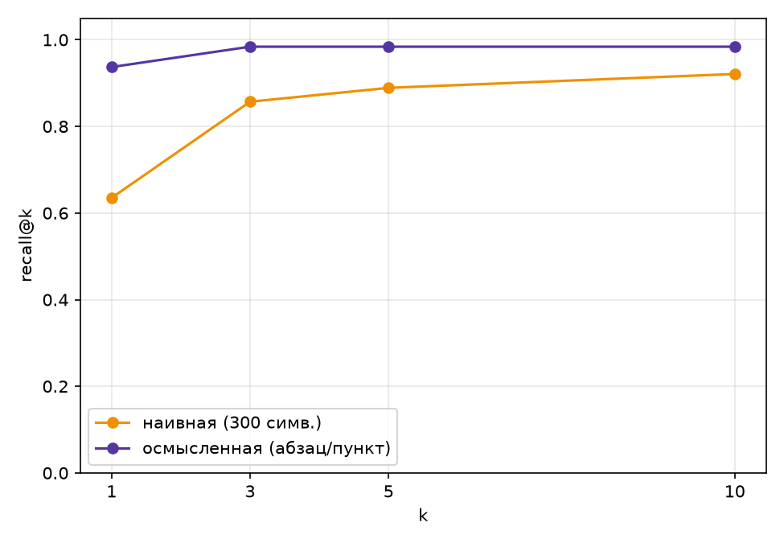
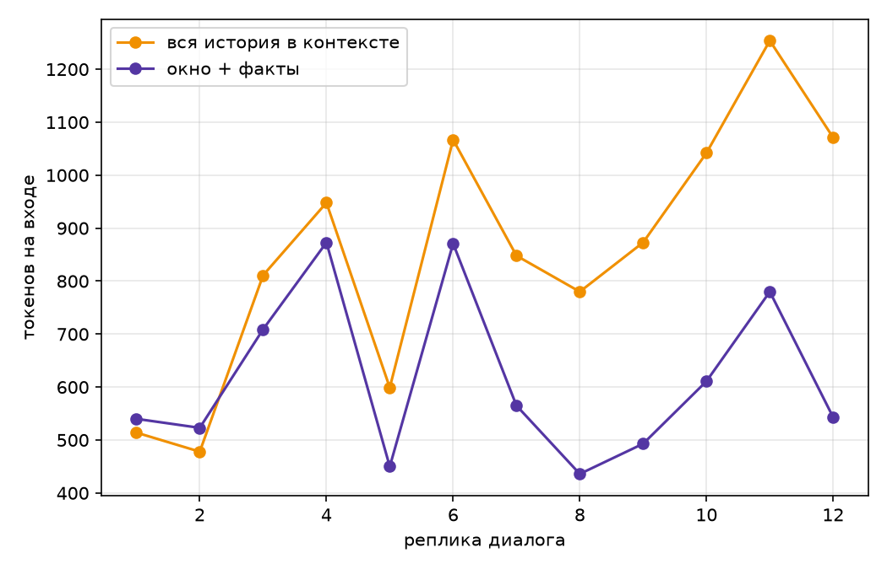

# Pet Agent

Учебный проект по разработке собственного LLM-агента на Python.

## Prerequisites

- Python 3.10+ Проверить версию: python --version
- Аккаунт OpenRouter с API-ключом (формат sk-or-v1-...)

## Quick Start

1. Клонируйте репозиторий и перейдите в его директорию

```bash
   git clone <ссылка-на-репозиторий>
   cd pet-agent
```

2. Установите зависимости

```bash
   pip install requests pydantic python-dotenv
```

3. Настройте переменные окружения

```bash
   cp .env.example .env
```

4. Впишите ваши ключи в .env:

```
   OPENROUTER_API_KEY=sk-or-v1-...
   TAVILY_API_KEY=tvly-...
```

## Dataset (data/my_fresh_2026.jsonl)

Тема — свежие новости веб-разработки и фронтенда за 2026 год: обновления
браузеров, CVE, новые CSS/HTML-фичи, JS-библиотеки, конференции.

Источники — дайджесты **Frontend Status** на Habr (`#7, #8, #10, #14, #15, #18`, 68 из 72 вопросов) и две отдельные статьи, одна на Habr, одна на lawebbox.com (итого 2 домена: `habr.com`, `lawebbox.com`). Все источники открытые, вопросы и цитаты — по-русски.

## Fresh check

```
$ python check_fresh.py data/my_fresh_2026.jsonl --sonnet
записей: 72, проблем: 0

Sonnet без инструментов: 4 из 72 верно, 6%. Потрачено $0.233
критерий свежести пройден
  fresh-0: С какой даты максимальный срок жизни TLS-сертификатов сократился до 200 дней? -> 15 марта 2026 года
  fresh-25: Какие новые CSS-функции дают элементу номер и число соседей? -> Это функции `sibling-index()` и `sibling
  fresh-26: Какая библиотека позволяет встроить PDF в React, Solid и Svelte? -> PDFSlick
  fresh-27: Кто создал библиотеку Geometric.js? -> Библиотека Geometric.js была создана Гар
```

(`check_fresh_result.txt` — исходный вывод).

## Agent (agent.py)

ReAct-агент из `agent.py`: цикл с семинара (Ledger, детектор повторов, мягкое
завершение, трейс каждого прогона в JSON) плюс инструменты со свежим доступом
к интернету:

- `calculator`, `python_exec` — с семинара, без изменений;
- `web_search` / `web_search_ru` — вступление статьи en/ru Википедии;
- `page_find(title, keywords)` — полный текст статьи Википедии (`prop=extracts`
  без `exintro`), возвращает только строки с ключевыми словами. Нужен, когда
  факт лежит не во вступлении, а в теле длинной обзорной статьи;
- `tavily_search` — второй источник поиска (Tavily, 1000 запросов/мес бесплатно):
  ищет по всему интернету, а не только по Википедии, что важно для моего
  датасета — факты там из статей на Habr, а не из Википедии.

Тесты инструментов — `test_tools.py`, три случая на каждый (нормальный вход,
пустой результат, ошибка), сеть подменена моками, ключ и модель не нужны:

```bash
python test_tools.py
```

Демонстрационный прогон на своём датасете:

```bash
python agent.py --data data/my_fresh_2026.jsonl --n 8 --model cheap
```

Трейсы каждого вопроса пишутся в `traces/demo-<модель>/<id>.json`.

## Measure (measure.py)

Пять обязательных конфигураций на 50 вопросах из `data/my_fresh_2026.jsonl`:

```bash
python measure.py --data data/my_fresh_2026.jsonl --n 50
```

| Конфигурация                       | Модель            | Доля верных | Цена задачи | Цена верного | Шагов | Секунд |
| ---------------------------------- | ----------------- | ----------: | ----------: | -----------: | ----: | -----: |
| сильная, без инструментов          | claude-sonnet-4.6 |         12% |    $0.00261 |     $0.02179 |  1.00 |    3.7 |
| дешёвая, без инструментов          | gpt-4o-mini       |          0% |    $0.00005 |            ∞ |  1.00 |    1.7 |
| дешёвая, только поиск              | gpt-4o-mini       |         50% |    $0.00076 |     $0.00152 |  4.34 |   11.0 |
| дешёвая, поиск и чтение страницы   | gpt-4o-mini       |         48% |    $0.00083 |     $0.00174 |  4.64 |   10.1 |
| средняя, лучший набор инструментов | claude-haiku-4.5  |         54% |    $0.02125 |     $0.03935 |  3.42 |   12.9 |

Полный прогон (250 задач): $1.275, сырые строки — `results_raw.csv`, трейсы — `traces/<конфигурация>/<модель>/<id>.json`.


**Вывод.** Тезис курса подтвердился в главном: дешёвая модель с поиском
(gpt-4o-mini + tavily_search/web_search) даёт 50% верных при цене задачи
$0.00076 — точнее сильной модели без инструментов (12% при $0.00261) и в
14 раз дешевле за верный ответ ($0.00152 против $0.02179). Без инструментов дешёвая модель даёт честный ноль — она физически не может знать факты 2026 года, разница делает именно поиск, а не модель. Средняя модель с лучшим набором инструментов чуть точнее (54%), но за верный ответ платит в 26 раз больше дешёвой с поиском — на моих 50 вопросах доплата за модель посильнее почти не окупается.

Не подтвердилось — чтение страницы (`page_find`) само по себе не помогло: 48% против 50% у одного поиска, при этом шагов и цены чуть больше. В домашке `page_find` описан как рычаг для Википедии («в разы» на англоязычном стартовом наборе), но мой датасет собран из дайджестов Habr и статьи на lawebbox.com — там просто нет обзорных статей Википедии, которые стоило бы читать целиком. Второй источник, ради которого вообще стоило городить `page_find`, в моём случае — `tavily_search`, и именно он несёт весь прирост точности; сам `page_find` для этого датасета — мёртвый груз, а не провал идеи.

## ДЗ2. RAG и память

### Корпус (data/corpus_habr.jsonl)

Тема та же, что в ДЗ1 — свежие новости фронтенда и AI 2026 года, только теперь факты
лежат не в живом поиске, а в векторной базе. Источники — 10 статей Habr/lawebbox:
8 из них те же, на которые ссылаются вопросы `data/my_fresh_2026.jsonl` (дайджесты
Frontend Status #7, #8, #10, #14, #15, #18, статья про AI-агентов и статья на
lawebbox.com), плюс два дополнительных выпуска дайджеста (#9, #11) без своих вопросов —
чистый балласт, чтобы поиск не был тривиальным (не на каждой странице корпуса есть вопрос).

Собирал `fetch_habr_corpus.py`: свой HTML-парсер на BeautifulSoup (MediaWiki-скрипт
семинара `fetch_corpus.py` для Habr не подходит — это не Википедия). Из статьи вынимаются
заголовки разделов (`h2`/`h3`) и пункты/абзацы под ними, сохраняются в
`data/corpus_habr.jsonl` в формате `{"page", "url", "text"}`, где `text` — строки с
разметкой разделов `== Заголовок ==` (тот же приём, что в MediaWiki extract, чтобы
структурная нарезка могла трекать раздел так же, как в ноутбуке семинара).

Вопросы — `build_questions_habr.py`: из 72 вопросов ДЗ1 оставлены 63, в которых действительно содержались ответы (исправление с прошлой ДЗ). Добавлено 10 вопросов без ответа — по теме
корпуса (версии фреймворков/браузерные фичи 2026 года), но про факты, которых в этих
10 статьях нет (проверено вручную по корпусу). Итог — `data/questions_habr.jsonl`,
73 строки, поле `answerable` отличает две группы.

После нарезки получается заметно больше требуемых 300 кусков на обеих нарезках:
**356** у наивной (300 символов) и **368** у осмысленной (абзац/пункт дайджеста).

### Индекс и качество поиска

Осмысленная нарезка (`chunk_sections` в `rag.py`) режет не по фиксированной длине, а
по структуре: заголовок раздела (`h2`/`h3` в HTML, `== ... ==` в тексте) становится
метаданными `section`, а каждый пункт списка/абзац под ним — отдельным куском. Habr-
дайджест — это список независимых новостей под заголовками разделов, поэтому абзац
= одна новость = одна проверяемая идея, и граница куска естественно проходит именно там, а не
через произвольные 300 символов.

Обе нарезки проиндексированы в Milvus (`docker-compose.yml`, коллекции `habr_chars`/
`habr_lines`, метрика COSINE). Демонстрация фильтра — поиск по конкретному дайджесту
(`page == "Frontend Status #8"`) в `build_index.py`.



Разница огромная уже на k=1: **0.635** у наивной против **0.937** у осмысленной — тот
же эффект, что в предупреждении задания («одна замена нарезки подняла recall@1 с 0.5 до
0.9»). Дальше выбран **k=5**: обе кривые к этому k уже вышли на плато (наивная 0.889,
осмысленная 0.984), а гибрид на k=5 достигает 1.0 — больше пяти кусков в контекст
осмысленно не добавляет, только удорожает промпт.

Гибрид (вектор + слова, RRF, `k=5`, `K=60`) на осмысленной нарезке:

| k   | вектор | слова |    гибрид |
| --- | -----: | ----: | --------: |
| 1   |  0.937 | 0.794 |     0.952 |
| 3   |  0.984 | 0.937 |     0.968 |
| 5   |  0.984 | 0.952 | **1.000** |
| 10  |  0.984 | 0.968 |     1.000 |

Ключевые слова одни заметно слабее вектора (у Habr-новостей смысл часто не совпадает
с точными словами вопроса), но в паре с вектором RRF закрывает последние промахи —
на k=5 добирает recall до 100%.

### Итоговая таблица и картинка (measure_rag.py, все 63 вопроса с ответом)

| Конфигурация                      | Модель            | Доля верных | Цена задачи | Цена верного | Шагов | Секунд |
| --------------------------------- | ----------------- | ----------: | ----------: | -----------: | ----: | -----: |
| сильная, без инструментов         | claude-sonnet-4.6 |        9.5% |    $0.00256 |     $0.02683 |  1.00 |    3.4 |
| дешёвая, живой поиск (ДЗ1)        | gpt-4o-mini       |       41.3% |    $0.00075 |     $0.00183 |  4.41 |   11.6 |
| дешёвая, RAG всегда               | gpt-4o-mini       |       74.6% |    $0.00010 |     $0.00014 |  1.00 |    1.4 |
| дешёвая, агент с `knowledge_base` | gpt-4o-mini       |       74.6% |    $0.00022 |     $0.00029 |  2.13 |    3.7 |
| средняя, RAG всегда               | claude-haiku-4.5  |       82.5% |    $0.00123 |     $0.00149 |  1.00 |    2.1 |

Полный прогон (5 × 73 вопроса, считая 10 безответных): $0.3602, сырые строки —
`results_rag.csv`, трейсы — `traces_rag/<конфигурация>/<модель>/<id>.json`.


### Таблица отказов

| Конфигурация                      | Модель            | Честно отклонил (из 10 безответных) | Ложно отклонил (из 63 с ответом) |
| --------------------------------- | ----------------- | ----------------------------------: | -------------------------------: |
| сильная, без инструментов         | claude-sonnet-4.6 |                                   0 |                                0 |
| дешёвая, живой поиск (ДЗ1)        | gpt-4o-mini       |                                   0 |                                0 |
| дешёвая, RAG всегда               | gpt-4o-mini       |                              **10** |                               10 |
| дешёвая, агент с `knowledge_base` | gpt-4o-mini       |                                   7 |                            **3** |
| средняя, RAG всегда               | claude-haiku-4.5  |                                   1 |                                2 |

У конфигураций без явного контракта `NOT_FOUND` (первые две строки) отказов не бывает
в принципе — они не умеют отказываться, только гадать. `RAG всегда` на дешёвой модели
отклоняет идеально честно (10 из 10 безответных), но ценой избыточной осторожности —
ложно отклоняет 10 из 63 нормальных вопросов (16%). Агент с `knowledge_base` рискует
чуть больше (пропускает 3 из 10 безответных), зато ложных отказов у него втрое меньше
(3 из 63) — самому решать, когда и как искать, оказалось выгоднее, чем искать вслепую
на каждый вопрос.

### Два разобранных провала (лучшая конфигурация: средняя модель, RAG всегда)

**Поиск не нашёл** (`habr-48`, «Какой отчёт обновился в марте 2026?», эталон: WCAG 3).
Вопрос сформулирован слишком общо — «какой отчёт обновился» семантически близок сразу
к десятку новостей про обновления (TC39, Baseline, Chrome 147…), и правильный кусок
(«Обновился Working Draft WCAG 3») не попал в top-5 по вектору. Агент честно ответил
`NOT_FOUND`. Чинить нужно поиск: этот же вопрос на гибридной (вектор+слова) нарезке
скорее всего нашёлся бы — точное слово «WCAG» дало бы огромный вес в keyword-поиске,
которого векторному сходству не хватило.

**Нашёл, но ответ неверный** (`habr-4`, «Какая уязвимость была исправлена в Angular
SSR?», эталон: «SSRF и инъекции заголовков»). Золотой кусок — первым в top-5, модель
его использовала и ответила по существу: «SSRF, инъекции заголовков и открытый
редирект» — верно, но добавила третью деталь и заменила соединяющее «и» на запятую,
из-за чего строгая проверка `is_correct` (точная подстрока) засчитала ответ как
неверный. Здесь чинить нужно не поиск и не нарезку, а промпт/проверку ответа:
`RAG_SYSTEM` стоит попросить отвечать вплотную к формулировке источника, без
дополнений, либо ослабить `is_correct` до пересечения по словам вместо точной
подстроки — модель фактически права, просто не той же строкой.

### Память

Эпизодическая память — построчный журнал `episodes.jsonl` (сессия, время, роль,
текст), в контекст модели никогда не попадает. Семантическая — факты в отдельной
Milvus-коллекции `facts` + зеркало в `facts.json`; извлекает их дешёвая модель в конце
сессии (`memory_demo.py` → `end_session`), возвращая **полный** обновлённый список, а
не дельту — так новый факт заменяет старый, а не ложится рядом.

Демонстрация двух сессий: в первой пользователь называет имя/город/работу/увлечение
(Калининград, хоккей) и попутно задаёт вопрос по базе — агент отвечает верно
(`focusgroup`). Во второй сессии (**новая, пустая история** — переписка сессии 1 в
контекст не попадала) агент на вопрос «где я живу и чем увлекаюсь» верно называет
город из памяти. Затем пользователь сообщает о переезде в Санкт-Петербург и смене
увлечения на футбол — после `end_session` в `facts.json` лежит **обновлённая** версия
(`city: Санкт-Петербург`, `interests: футбол`), старые значения не задублировались.



На 12 репликах: «вся история» — 10211 токенов на входе суммарно, $0.00173; «окно +
факты» — 7391 токен, $0.00133 (на **28% дешевле**). Разрыв растёт с каждой репликой —
на длинном диалоге экономия только увеличивается, а активные факты о пользователе при
этом никуда не теряются.

### Вывод

Тезис курса подтвердился и усилился по сравнению с ДЗ1. RAG на той же
дешёвой модели экономит уже **190×** ($0.00014 против $0.02683 за верный ответ) — база
знаний рядом дешевле и точнее, чем поход в живой поиск за теми же фактами (74.6% против
41.3% при этом на порядок ниже цена). Средняя модель с RAG даёт лучшую точность (82.5%),
но за 10 дополнительных процентных пунктов платит десятикратной ценой — тот же
диминишинг-ретёрнс, что и в ДЗ1, только на новом фундаменте.

Не всё однозначно: конфигурация «агент сам решает, когда искать» не обгоняет по
точности постоянный RAG (74.6% у обеих), зато втрое честнее в отказах (см. таблицу
выше) — метрика «доля верных» одна не показывает всю картину, нужна отдельная таблица
отказов, как и просило задание. И «нашёл, но неверно» из разбора провалов — это не
всегда провал поиска: иногда модель права по смыслу, просто не совпадает дословно с
эталоном, и здесь тезис курса («дать модели пять нужных строк вместо всей страницы»)
подтверждается ровно наполовину — правильные строки в контексте были, дешёвого верного
ответа на них не хватило только из-за слишком строгой проверки.
